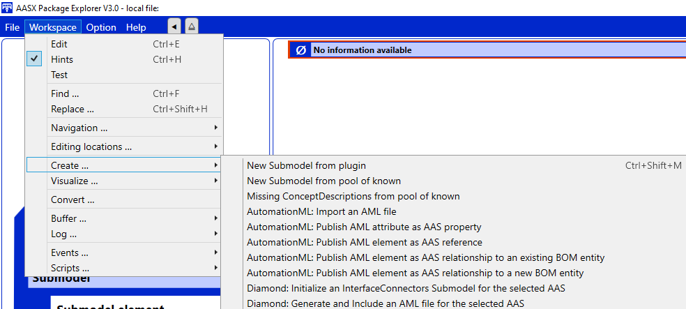

# aml-aaspe-plugin

A plugin for the [Eclipse AASX Package Explorer<small>TM</small>](https://github.com/eclipse-aaspe/package-explorer) (*AASPE*) demonstrating the integration of AutomationML and Asset Administration Shell as proposed in the *AutomationML* *Application Recomendation* [AutomationML in Asset Administration Shells](https://www.automationml.org/wp-content/uploads/2024/05/AR-Integrating-AML-projects-in-AAS.zip).

In addition, several actions highlight results from the [*DIAMOND* research project](https://diamond-project.de/en/) are provided.

## Installation

- Download a current release of the *AASPE* from [https://github.com/eclipse-aaspe/package-explorer/releases](https://github.com/eclipse-aaspe/package-explorer/releases). This plugin was tested against version *v2024-06-10.alpha* but newer releases should also work unless there are major changes in the plugin architecture.
- Refer to the readme of *AASPE* for installation instructions.
- Download the latest release of this plugin from the [releases](https://github.com/de-ich/aml-aaspe-plugin/releases).
- Unzip the contents of the plugin to the `plugins` folder of you *AASPE* installation.
- Note: After that, your `plugins` folder should contain a folder `AasxPluginAml`.

## Debugging

- Clone this repository
- Build the project
- Make sure that your version of *AASPE* uses exactly the same version of the built plugin code, by
  - copying the build results to the plugin folder of *AASPE* as described in the installation section above,
  - creating a symlink from the plugin folder of *AASPE* to your build output folder, or
  - adjust the file `AasxPackageExplorer.options.json` of your *AASPE* to include the build output folder.
- Start *AASPE*
- Attach the debugger to the running *AASPE* process, e.g. by selecting `Debug -> Attach to process...` in Visual Studio

## General Usage

This plugin adds several actions to the *AASPE*. After completing the steps described in the *Installation* section and starting the *AASPE*, these actions should be available via `Workspace -> Create...` as shown in the following screenshot:

